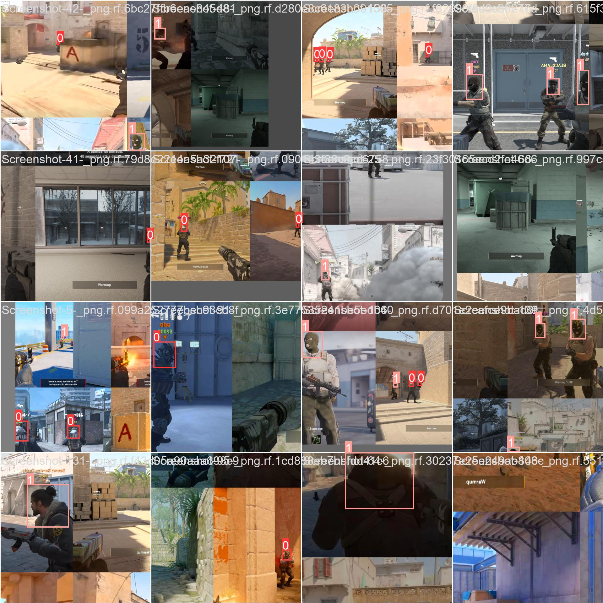
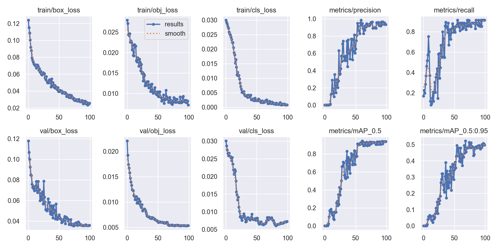
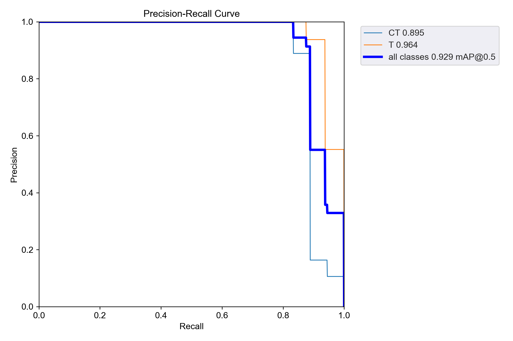

YOLOv5 即時螢幕目標偵測與滑鼠控制

本專案使用 YOLOv5
進行即時物件偵測，並透過即時螢幕截圖分析畫面中的目標，計算目標與畫面中心的距離，當按下滑鼠側鍵時自動將準心移動到最近的目標位置。

================================================== 專案功能
==================================================

-   即時螢幕擷取
-   YOLOv5 物件偵測
-   計算目標與畫面中心距離
-   自動選擇最近目標
-   準心移動到目標區域
-   使用滑鼠側鍵 (X1) 開啟 / 關閉功能
-   畫面即時顯示偵測框與距離資訊

================================================== 專案結構
==================================================

## 專案結構 (Project Structure)

```
yolov5-aim-detection/
│
├─ assets/ # 訓練與評估結果圖片
│ ├─ train_batch0.jpg # 訓練資料與標註示例
│ ├─ val_batch0_pred.jpg # 模型預測結果示例
│ ├─ results.png # 訓練過程指標變化
│ ├─ PR_curve.png # Precision-Recall 曲線
│ └─ confusion_matrix.png # 混淆矩陣
│
├─ weights/ # YOLO 模型權重
│ └─ yolov5n.pt
│
├─ models/ # YOLOv5 模型架構
├─ utils/ # YOLOv5 工具函式
├─ data/ # 資料集設定
│
├─ Screenshot.py # 螢幕截圖模組
├─ SendInput.py # 滑鼠控制模組
├─ detect.py # 即時偵測與自動瞄準主程式
│
├─ train.py # 模型訓練
├─ val.py # 模型驗證
├─ export.py # 模型轉換
│
├─ requirements.txt # Python 套件依賴
├─ .gitignore
└─ README.md
```


================================================== 操作方式
==================================================

滑鼠側鍵 (X1)

按下：啟動目標追蹤 放開：停止追蹤

程式會：

1.  截取螢幕畫面
2.  進行 YOLO 物件偵測
3.  計算每個目標與畫面中心距離
4.  選擇距離最近的目標
5.  移動滑鼠到目標位置

================================================== 模型說明
==================================================

預設模型：

weights/yolov5n.pt

可替換為：

yolov5s.pt yolov5m.pt yolov5l.pt


================================================== 一些訓練測試結果
==================================================

## Dataset Example

下圖為訓練資料集中的影像與標註框示例：



## Training Results

模型訓練過程中的 loss 與評估指標變化：



## Precision-Recall Curve

模型在不同 confidence threshold 下的 Precision-Recall 表現：



## 結論

在物件偵測任務中，傳統的 accuracy 並不能完整反映模型表現，因此 YOLOv5 主要使用 Precision、Recall 以及 mAP (mean Average Precision) 作為評估指標。

Precision：模型預測為目標的結果中，有多少是正確的

Recall：所有真實目標中，有多少被模型成功偵測

mAP@0.5：在 IoU ≥ 0.5 的情況下計算平均精度，用來衡量整體偵測能力

在我的實驗中，模型在 validation dataset 上達到穩定的 Precision、Recall 與 mAP 表現。

DEMO

[DEMO1](https://youtu.be/Zv7sV6Ywaho)

[DEMO2](https://youtu.be/3MjpjRlGc1Y)

[DEMO3](https://youtu.be/er2pSG7P0Fw)

================================================== License

此專案僅供學習與研究用途
